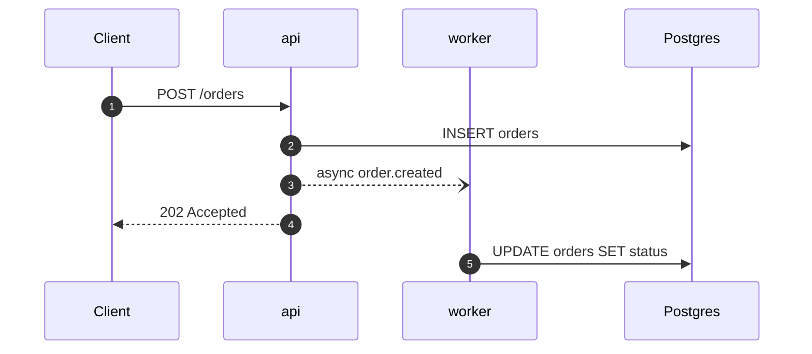
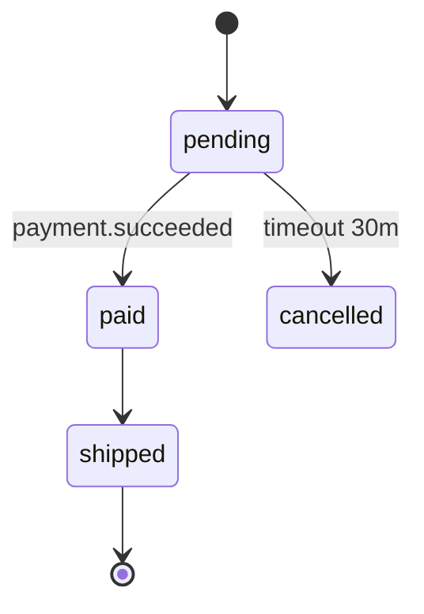

# Diagrams

Shared by `map`, `flow` and `explain`. Mermaid only, in fenced blocks, so the diagram renders on
GitHub, in editors and in most wikis, and so it stays diffable and greppable. An image cannot be
reviewed in a pull request, cannot be searched, and cannot be corrected by the next agent.

A diagram earns its place by showing something a table cannot: ordering, concurrency, or shape. A
diagram that lists things is a table drawn badly.

## Which diagram

| Question the reader has | Diagram | Where |
|---|---|---|
| What talks to what | `flowchart LR` | `architecture.md`, root index |
| In what order, across units | `sequenceDiagram` | `flows/` |
| What states can this be in | `stateDiagram-v2` | unit doc, when a status column exists |
| What is stored and how it relates | `erDiagram` | `data.md`, only when relations are the point |
| How does this mechanism work | `flowchart` plus a drawn table | `explain/` |

Nothing else. Class diagrams and mind maps do not answer a question anyone brings to a codebase.

## Rules

- **Real participants only.** Every box is a unit, a store or an external system that exists and can
  be named in the code. No box called "Business Logic".
- **Ceiling of fifteen arrows.** Past that the diagram is decoration. Split it: `flows/<name>.md`
  and `flows/<name>-part2.md`, with the first ending where the second begins.
- **Label every arrow** with what is actually sent: the endpoint, the message, the query. An unlabelled
  arrow says two things are connected, which the reader already assumed.
- **Async is dashed and labelled** `async`. Where a response returns before the work finishes, the
  diagram must show it, since that gap is where the reader's mental model breaks.
- **One diagram per file.** A second diagram means a second question, which means a second file.
- Keep participant names equal to unit names. A diagram that renames a service to fit the box costs
  every reader one translation.

## Sequence



## Component

```mermaid
flowchart LR
    C[Client] --> API[api]
    API --> DB[(Postgres)]
    API -. order.created .-> Q[[Kafka]]
    Q --> W[worker]
    W --> DB
```

Stores use `[(…)]`, queues use `[[…]]`, services use `[…]`. Keeping the shapes consistent across
every diagram in the atlas means a reader learns the notation once.

## State



Transitions carry the event or condition that fires them. A state diagram without labelled edges
tells the reader what is possible but never how to get there.
