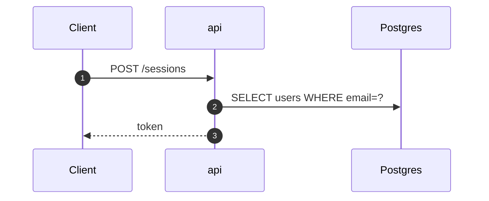

# Command: flow — one request end to end → `flows/<name>.md`

For behaviour that crosses units: a login, a message send, a checkout, an export. This is the doc
someone opens at 03:00 while the thing is broken. It has to let them follow one request from client
to storage without opening the code, and hand them exact coordinates the moment they do.

Run only after every unit the flow crosses has been mapped. A flow written across an undocumented
unit guesses at that hop, and a guessed hop is indistinguishable from a real one once written down.

## Method

1. Find the entry point: the route, the RPC, the consumed message. Grep the handler name across all
   units.
2. Walk hop by hop. At each hop record file, line, function, what it decides, what it writes, what
   it calls next. Follow into the callee unit. Stop at storage, cache or an external system.
3. **Every branch that changes the outcome is a hop**: a permission denial, an error return, a
   retry, an async fork.
4. Where the trace reaches a stub, stop and tag `📋`. Do not complete the path from the spec, and
   do not complete it from what the code obviously intends to do.

## Template

````markdown
---
flow: <name>
units: <unit>, <unit>
branch: <branch> @ <commit>
written: <YYYY-MM-DD>
status: ✅ | 🟡 | 📋
---

# Flow: <name>

**Entry:** `<method> <path>` or `<Service.Rpc>` · **Units:** …

## TL;DR
Three lines: what triggers it, what it changes, what it emits.

## Sequence



## Hops

| # | Unit | Function | File:line | Does | Reads / writes | Next |
|---|------|----------|-----------|------|----------------|------|
| 1 | api | `SessionHandler.Create` | `internal/http/session.go:41` | validate body, rate-limit by email | redis `login:fail:*` | 2 |

Every row cites. A hop you could not verify does not get a row; it goes in Open questions.

## Data at each boundary
What crosses the wire, and which fields the next hop actually reads. Fields that are set and never
read are worth naming: they are usually a bug or a dead requirement.

## Failure modes
| Failure | Where | Behaviour | Consequence |
|---------|-------|-----------|-------------|

Include transaction boundaries: what rolls back, and what has already escaped when it does.

## Open questions
````

## Rules

- One flow, one file. Never bundle "the chat flows" into one document.
- Async hops are drawn dashed and labelled `async`. The reader must be able to see the point where
  the response returns before the work has finished, because that gap is where the bugs live.
- Re-verify line numbers immediately before writing. A stale citation is worse than none, since it
  costs a read and then teaches the reader to distrust the rest.
- Link the unit docs for detail rather than restating their tables.
- Read [references/diagrams.md](diagrams.md) first.
