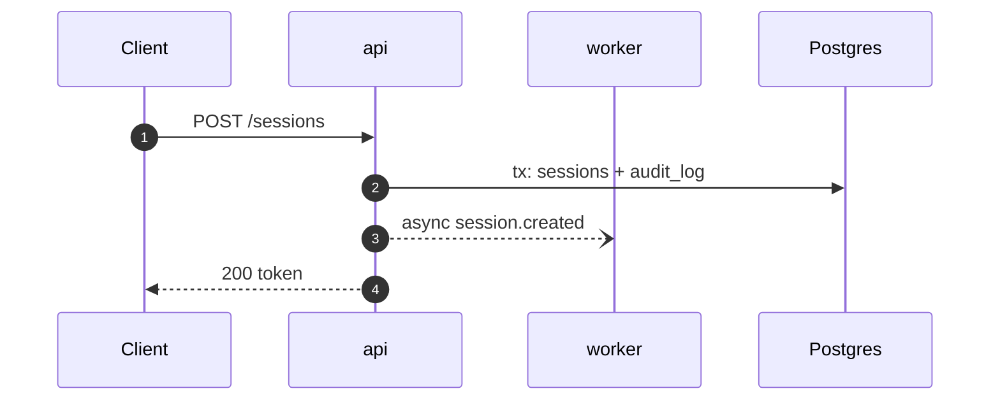

# Command: flow — one request end to end → `flows/<name>.md`

For behaviour that crosses units: a login, a message send, a checkout, an export. This is the doc
someone opens at 03:00 while the thing is broken. It orients them across boundaries and names the
minimum code needed to verify or change the flow.

Run only after every unit the flow crosses has been mapped. A guessed hop is indistinguishable from a
real one once written down.

## Write the order, not the steps

You read the whole path; you write its shape. What a reader cannot get by opening the entry point is
the **ordering across units** — which unit runs second, where the transaction closes, where the
response leaves before the work finishes. What they *can* get by opening it is what each function
does, so leave that to them.

A hop table that paraphrases each function is code transcribed into markdown: it rots on the next
rename, and it invites the reader to trust it instead of the file.

## Method

1. Find the entry point: the route, the RPC, the consumed message. Grep the handler across all units.
2. Walk hop by hop to learn the flow. Record only what survives a refactor: which unit, which door
   you go in by, and what the hop **commits to** — a transaction opening or closing, an event
   published, an external call, a retry, a fork to async.
3. **Every branch that changes the outcome is a hop**: a permission denial, an error return, a retry,
   an async fork.
4. Where the trace reaches a stub, stop and mark `📋 not built at <sha>`. Do not complete the path
   from the spec, and do not complete it from what the code obviously intends to do.

## Template

````markdown
---
kind: flow
unit: <unit>, <unit>
read: <branch> @ <sha>
written: <YYYY-MM-DD>
---

# Flow: <name>

**Entry:** `<method> <path>` or `<Service.Rpc>`

## TL;DR
Three lines: what triggers it, what it changes, what it emits.

## Sequence



## Hops

| # | Unit | Door in | Commits to | Next |
|---|------|---------|------------|------|
| 1 | api | `internal/http/session.go#Create` | nothing; rate-limits, then delegates | 2 |
| 2 | auth | `internal/auth/session.go#Issue` | opens the tx writing `sessions` + `audit_log` | 3 |
| 3 | api | — | responds `200`; the async fork has **not** run | — |

One row per unit boundary or outcome-changing branch, not per function call. **Door in** is the symbol
the reader opens to read that hop themselves. **Commits to** is only what is invisible from that door;
if it would be a paraphrase of the function name, leave the cell empty — the citation was the row.

A hop you could not verify gets no row. It goes in Open questions.

## Ordering constraints
**The reason this file exists.** What must happen before what, and what breaks otherwise: the
transaction that must close before the event fires, the idempotency key that makes hop 4 safe to
retry, the read that must not go to a replica. Design facts — they outlive every rename above.

## Failure modes
| Failure | Where | Consequence |
|---------|-------|-------------|

What rolls back, and what has already escaped when it does.

## Open questions
````

## Rules

- One flow, one file. Never bundle "the chat flows" into one document.
- **The diagram carries the order, the table carries the addresses.** Neither carries the logic. If
  the two disagree with each other, you wrote the flow twice.
- Async hops are dashed and labelled `async`. Where a response returns before the work finishes, the
  diagram must show it — that gap is where the bugs live.
- Do not reproduce payloads. Name which fields the next hop actually reads, and which cross the wire
  unread: those are usually a bug or a dead requirement.
- Link the unit docs for detail rather than restating their tables.
- Read [diagrams.md](diagrams.md) first.
